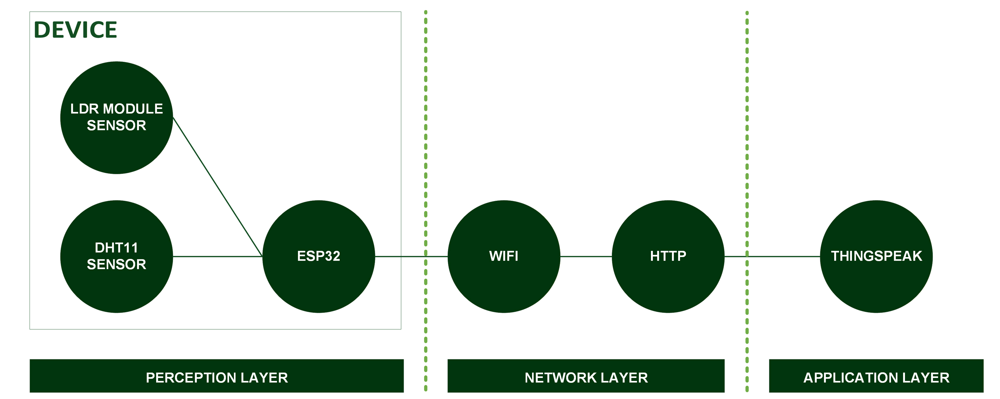

[](https://github.com/ellerbrock/open-source-badges/)
[](https://opensource.org/license/gpl-3.0)


# ThingSpeak Environmental Monitoring System
Environmental monitoring system — monitors temperature, humidity, and light intensity with cloud-based data logging and real-time dashboard visualization through ThingSpeak.

<br><br>

## Project Requirements
| Part | Description |
| --- | --- |
| Development Board | DOIT ESP32 DEVKIT V1 |
| Code Editor | Arduino IDE 1.8.19 (Stable Legacy Version) |
| Driver | CP210X USB Driver |
| IoT Platform | ThingSpeak |
| Communications Protocol | Hypertext Transfer Protocol (HTTP) |
| IoT Architecture | 3 Layer |
| Programming Language | C/C++ |
| Arduino Library | • WiFi (default)<br>• DHT sensor library by Adafruit (Version: 1.4.6)<br>• ThingSpeak by MathWorks (Version: 2.1.1) |
| Sensor | • DHT11: Air Temperature & Humidity (x1)<br>• LDR Sensor Module (x1) |
| Other Components | • Micro USB cable - USB type A (x1)<br>• ESP32 expansion board (x1)<br>• Adaptor DC 9V 1A (x1)<br>• Jumper cable (1 set) |

<br><br>

## Download & Install
1. Arduino IDE

   <table><tr><td width="810">

   ```
   https://bit.ly/ArduinoIDE_Installer
   ```

   </td></tr></table><br>

2. CP210X USB Driver

   <table><tr><td width="810">
   
   ```
   https://bit.ly/CP210X_USBdriver
   ```

   </td></tr></table>
   
<br><br>

## Project Designs

<table>
<tr>
<th width="840">Architecture</th>
</tr>
<tr>
<td align="center"></td>
</tr>
</table>
<table>
<tr>
<th width="840">Software Design</th>
</tr>
<tr>
<td align="center"></td>
</tr>
</table>
<table>
<tr>
<th width="420">Pictorial Diagram</th>
<th width="420">Block Diagram</th>
</tr>
<tr>
<td align="center"></td>
<td align="center"></td>
</tr>
</table>
<table>
<tr>
<th width="840">Wiring</th>
</tr>
<tr>
<td align="center"></td>
</tr>
</table>

<br><br>

## Arduino IDE Setup
1. Open the ``` Arduino IDE ``` first, then open the project by clicking ``` File ``` -> ``` Open ``` :

   <table><tr><td width="810">
      
      ``` Code.ino ```

   </td></tr></table><br>
   
2. Fill in the ``` Additional Board Manager URLs ``` in Arduino IDE

   <table><tr><td width="810">
         
      Click ``` File ``` -> ``` Preferences ``` -> enter the ``` Boards Manager Url ``` by copying the following link :
      
      ```
      https://dl.espressif.com/dl/package_esp32_index.json
      ```

   </td></tr></table><br>
   
3. ``` Board Setup ``` in Arduino IDE

   <table>
      <tr><th width="810">

      How to setup the ``` DOIT ESP32 DEVKIT V1 ``` board
            
      </th></tr>
      <tr><td width="810">
         
      • Click ``` Tools ``` -> ``` Board ``` -> ``` Boards Manager ``` -> Install ``` esp32 ```.
   
      • Then selecting a board by clicking: ``` Tools ``` -> ``` Board ``` -> ``` ESP32 Arduino ``` -> ``` DOIT ESP32 DEVKIT V1 ```.

      </td></tr>
   </table><br>
   
4. ``` Change the Board Speed ``` in Arduino IDE

   <table><tr><td width="810">
         
      Click ``` Tools ``` -> ``` Upload Speed ``` -> ``` 115200 ```

   </td></tr></table><br>
   
5. ``` Install Library ``` in Arduino IDE

   <table><tr><td width="810">
         
      Download all the library zip files. Then paste it in the: ``` C:\Users\Computer_Username\Documents\Arduino\libraries ```

   </td></tr></table><br>

6. ``` Port Setup ``` in Arduino IDE

   <table><tr><td width="810">
         
      Click ``` Port ``` -> Choose according to your device port ``` (you can see in device manager) ```

   </td></tr></table><br>

7. Change the ``` WiFi Name ```, ``` WiFi Password ```, and so on according to what you are currently using.<br><br>

8. Before uploading the program, please click: ``` Verify ```.<br><br>

9. If there is no error in the program code, then please click: ``` Upload ```.<br><br>
    
10. Some things you need to do when using the ``` ESP32 board ``` :

    <table><tr><td width="810">
       
       • If ``` ESP32 board ``` cannot process ``` Source Code ``` totally -> Press ``` EN (RST) ``` button -> ``` Restart ```.

       • If ``` ESP32 board ``` cannot process ``` Source Code ``` automatically then :<br>

      - When information: ``` Uploading... ``` has appeared -> immediately press and hold the ``` BOOT ``` button.<br>

      - When information: ``` Writing at .... (%) ``` has appeared -> release the ``` BOOT ``` button.

      • If message: ``` Done Uploading ``` has appeared -> ``` The previously entered program can already be operated ```.

      • Do not press the ``` BOOT ``` and ``` EN ``` buttons at the same time as this may switch to ``` Upload Firmware ``` mode.

    </td></tr></table><br>

11. If there is still a problem when uploading the program, then try checking the ``` driver ``` / ``` port ``` / ``` others ``` section.

<br><br>

## ThingSpeak Setup
1. Getting started with ThingSpeak :

   <table><tr><td width="810">

      • Please <a href="https://thingspeak.com/login">Log in</a> to access the ThingSpeak service.
      
      • If you don't have a ThingSpeak account yet, please create one.

   </td></tr></table><br>

2. Create a channel :

   <table><tr><td width="810">

      • After logging into the account -> click ``` New Channel ```.
   
      • Fill in the form according to your needs.
   
      • Click ``` Save Channel ```.
   
      • Click ``` Sharing ``` -> in the ``` Channel Sharing Settings ``` section, please select -> ``` Keep channel view private ```.

   </td></tr></table><br>

3. Create visualizations :

   <table><tr><td width="810">

      • Make sure you are in the ``` Channel ``` menu -> ``` Private View ``` section.
   
      • Click ``` + Add Visualization ```.
   
      • Click ``` Field Chart ``` -> then select ``` Save ```.
   
      • If you want to change the visualization content, please click ``` Field Chart Option ``` -> then select ``` Save ``` to save.

   </td></tr></table><br>

4. Firmware configuration :

   <table><tr><td width="810">

      • Make sure you are in the ``` Channel ``` menu -> ``` Private View ``` section.
   
      • Copy the ``` Channel ID ``` -> paste it into the firmware code. For example :
   
      <table><tr><td width="780">

      ```ino
      unsigned long myChannelNumber = '1504372'; // ID Channel ThingSpeak
      ```

      </td></tr></table>
   
      • Please go to the ``` API Keys ``` section -> paste it into the firmware code. For example :
   
      <table><tr><td width="780">

      ```ino
      const char* myWriteAPIKey = "TF3UPJK9O1QA5FAU"; // Apikey ThingSpeak
      ```

      </td></tr></table>

   </td></tr></table>

<br><br>

## Get Started
1. Download and extract this repository.<br><br>
    
2. Make sure you have the necessary electronic components.<br><br>
   
3. Make sure your components are designed according to the diagram.<br><br>
      
4. Configure your device according to the settings above.<br><br> 
 
5. Please enjoy [Done].

<br><br>

## Highlights

<table>
<tr>
<th width="840" colspan="4">Device</th>
</tr>
<tr>
<th width="420" colspan="2">DHT11 Sensor</th>
<th width="420" colspan="2">LDR Sensor</th>
</tr>
<tr>
<td width="210" align="center"></td>
<td width="210" align="center"></td>
<td width="210" align="center"></td>
<td width="210" align="center"></td>
</tr>
</table>
<table>
<tr>
<th width="840">ThingSpeak Dashboard</th>
</tr>
<tr>
<td align="center"></td>
</tr>
</table>

<br>
<strong>More information:</strong> <a href="https://github.com/cakraawijaya/ThingSpeak-Environmental-Monitoring-System/blob/master/Assets/Documentation/Report/Portofolio%20Pelatihan%20Sertifikasi%20BNSP%20IIoT%20-%20Devan%20Cakra%20Mudra%20Wijaya-2-13.pdf"><u>Click Here</u></a>

<br><br><br>

## Appreciation
If this work is useful to you, then support this work as a form of appreciation to the author by clicking the ``` ⭐Star ``` button at the top of the repository.

<br><br>

## Disclaimer
This application is the result of the development of the Edutic.id x BNSP Bootcamp 2026. I do not deny that I still use third-party services in this work, including: libraries, frameworks, and so on.
